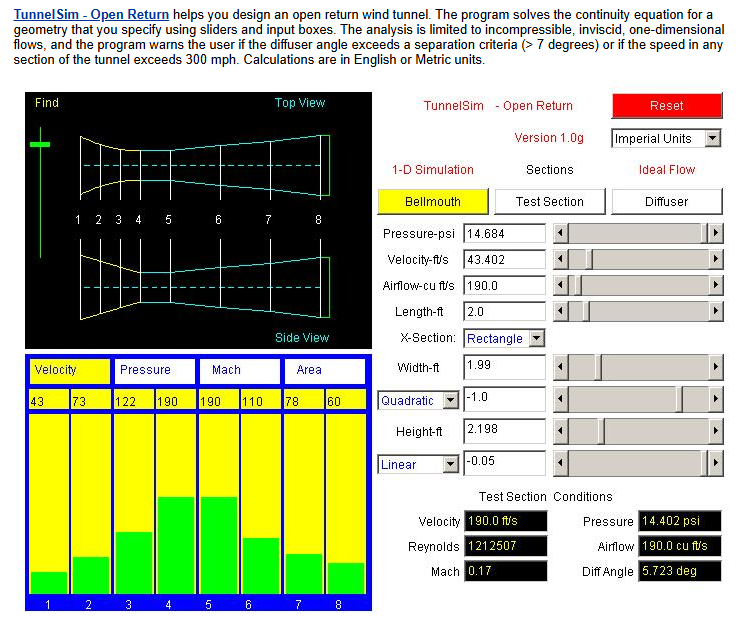
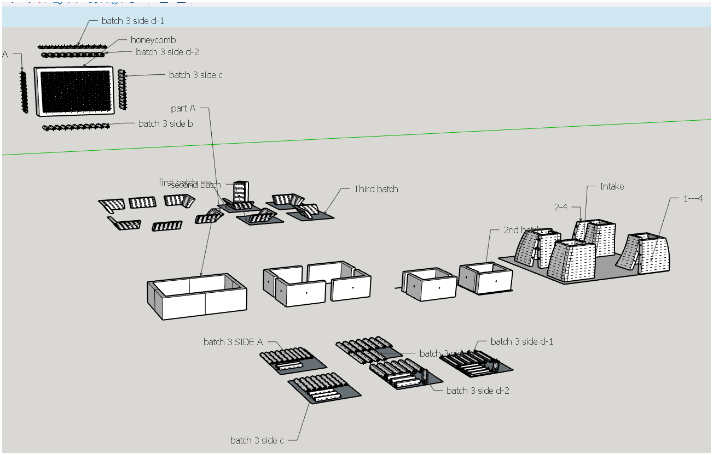

The motivation for building this wind tunnel was born out of my curiosity for fluid dynamics. I was particularly interested in creating a benchtop wind tunnel for flow visualization. This was also one of my very first projects involving 3D printing.
To determine appropriate dimensions, I borrowed from a NASA applet published many years ago, which can be found  based the dimensions on a NASA applet, which can be found <a href="https://www.grc.nasa.gov/www/k-12/TunnelSim/index.htm" target="_blank">here.</a>.
This simulator allowed me to apply realistic dimensions to my project and begin building.

   
  <em>Fig.1 TunnelSim applet published by NASA..</em>

The design consists of an open-return wind tunnel featuring a honeycomb structure at the intake to promote laminar flow. It also includes a test section equipped with passthrough holes for modifying specimen orientation or routing sensor cables. On the exhaust side, two 12 V DC motors handle airflow. I originally intended for the entire structure to be 3D-printed; however, due to the required dimensions, it was not feasible to print the expansion cone, as it must be very long to maintain boundary layer adhesion. Therefore, only critical geometries were printed, such as the intake, honeycomb, test section, and fan shrouds and mounts.

   
  <em>Fig. 2 Front view of intake section. Honeycomb structure visible</em>

To 3D print this design, the components were initially segmented and printed in batches due to limitations imposed by the available print bed size. The segmented parts were joined using dowels and adhesive bonding, which was selected as a simple and lightweight assembly method. However, this approach did not sufficiently account for dimensional inaccuracies inherent to FDM printing, resulting in accumulated alignment errors and a slightly misaligned final assembly.

To address these issues, future iterations will print the most geometrically complex components as single parts, leveraging access to a larger print bed. Additionally, the assembly strategy will be revised to use external flanged interfaces between components, improving alignment control, structural rigidity, and repeatability during assembly.

   
  <em>Fig. 2 Wind tunnel side view.</em>

   
  <em>Fig. 4 Parts segmentation before printing.</em>

   
  <em>Fig. 5 printing a batch.</em>

This project is ongoing, and updated images documenting the next design iteration will be posted as development continues. The initial prototype was modeled using SketchUp, prior to learning Autodesk Inventor and SolidWorks. While sufficient for the early concept, this approach limited dimensional accuracy and assembly testing
Future iterations will involve fully redrawing the design in Autodesk Inventor, allowing all components to be test-fit within a complete assembly environment prior to printing. This will improve alignment, tolerance control, and manufacturability.

   
  <em>Fig. 6 repurposing of RTX power supply.</em>

The project also requires a dedicated power source for the electric fans, which is currently being supplied by a repurposed RTX power supply. This solution provides adequate current capacity.
Once the mechanical and electrical systems are finalized, the project will be expanded to include a flow visualization system. This will consist of a device capable of generating aerosolized propylene glycol, allowing observation of airflow patterns within the test section. 

### For more information and files about this project, please visit the <a href="https://github.com/eliasreyess/Small-scale-wind-tunnel">repository.</a>

  

